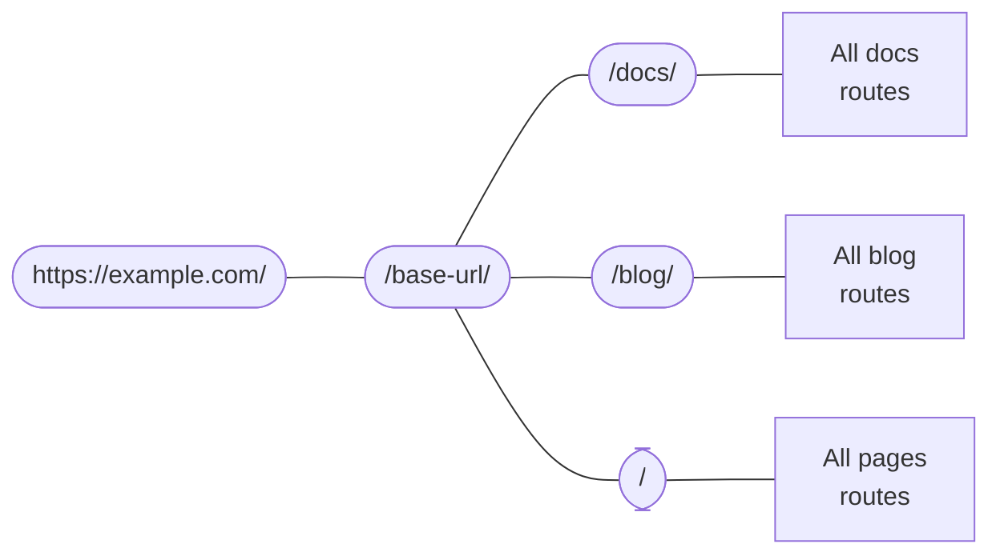

import Tabs from '@theme/Tabs';
import TabItem from '@theme/TabItem';

<Tabs>
  <TabItem value="apple" label="Apple" default>
    This is an apple 🍎
  </TabItem>
  <TabItem value="orange" label="Orange">
    This is an orange 🍊
  </TabItem>
  <TabItem value="banana" label="Banana">
    This is a banana 🍌
  </TabItem>
</Tabs>
:::note

Some **content** with _Markdown_ `syntax`. Check [this `api`](#).

:::

:::tip

Some **content** with _Markdown_ `syntax`. Check [this `api`](#).

:::

:::info

Some **content** with _Markdown_ `syntax`. Check [this `api`](#).

:::

:::warning

Some **content** with _Markdown_ `syntax`. Check [this `api`](#).

:::

:::danger

Some **content** with _Markdown_ `syntax`. Check [this `api`](#).

:::


export const Highlight = ({children, color}) => (
  <span
    style={{
      backgroundColor: color,
      borderRadius: '2px',
      color: '#fff',
      padding: '0.2rem',
    }}>
    {children}
  </span>
);

<Highlight color="#25c2a0">Docusaurus green</Highlight> and <Highlight color="#1877F2">Facebook blue</Highlight> are my favorite colors.

I can write **Markdown** alongside my _JSX_!


# Markdown page example

You don't need React to write simple standalone pages.
Estoy importando a una página de react este markdo

# Título con enlace

Seguimos probando cosas en docusaurus, docusaurus reconoce los encabezados de nivel dos y tres y crea un TOC ( tabla de control) en la parte derecha de la página donde puedes acceder a cada sección de tu markdown, los markdowns importados a componentes react no tienen esta función

Prueba mermaid


## Seguinmo

## Sección 1
Texto para la sección 1.

### Sub-sección 1.1
Texto para la sub-sección 1.1.

## Sección 2
Texto para la sección 2.

### Sub-sección 2.1
Texto para la sub-sección 2.1.

## mermaid

<details>
<summary>Output of the above workspace</summary>
```bash
build
├── 404.html                      # /404/
├── blog
│   ├── archive
│   │   └── index.html            # /blog/archive/
│   ├── first-blog-post
│   │   └── index.html            # /blog/first-blog-post/
│   ├── index.html                # /blog/
│   ├── long-blog-post
│   │   └── index.html            # /blog/long-blog-post/
│   ├── mdx-blog-post
│   │   └── index.html            # /blog/mdx-blog-post/
│   ├── tags
│   │   ├── docusaurus
│   │   │   └── index.html        # /blog/tags/docusaurus/
│   │   ├── hola
│   │   │   └── index.html        # /blog/tags/hola/
│   │   └── index.html            # /blog/tags/
│   └── welcome
│       └── index.html            # /blog/welcome/
├── docs
│   ├── 1.0.0
│   │   ├── intro
│   │   │   └── index.html        # /docs/1.0.0/intro/
│   │   ├── tutorial-basics
│   │   │   ├── congratulations
│   │   │   │   └── index.html    # /docs/1.0.0/tutorial-basics/congratulations/
│   │   │   └── markdown-features
│   │   │       └── index.html    # /docs/1.0.0/tutorial-basics/markdown-features/
│   │   └── tutorial-extras
│   │       ├── manage-docs-versions
│   │       │   └── index.html    # /docs/1.0.0/tutorial-extras/manage-docs-versions/
│   │       └── translate-your-site
│   │           └── index.html    # /docs/1.0.0/tutorial-extras/translate-your-site/
│   ├── intro
│   │   └── index.html            # /docs/1.0.0/intro/
│   ├── tutorial-basics
│   │   ├── congratulations
│   │   │   └── index.html        # /docs/tutorial-basics/congratulations/
│   │   └── markdown-features
│   │       └── index.html        # /docs/tutorial-basics/markdown-features/
│   └── tutorial-extras
│       ├── manage-docs-versions
│       │   └── index.html        # /docs/tutorial-extras/manage-docs-versions/
│       └── translate-your-site
│           └── index.html        # /docs/tutorial-extras/translate-your-site/
├── index.html                    # /
└── markdown-page
    └── index.html                # /markdown-page/
```
</details>


```md
### My Doc Section

Hello world message with some **bold** text, some _italic_ text, and a [link](/)


```

```mdx-code-block

<h3>My Doc Section</h3>

Hello world message with some **bold** text, some _italic_ text and a [link](/)


```

```bash
npx create-docusaurus@latest my-website classic
```